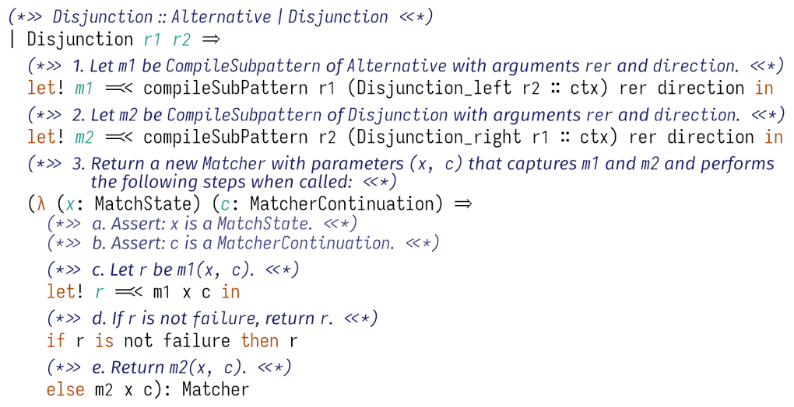
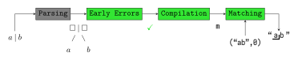

# Warblre: A Coq mechanization of ECMAScript regexes

This repository contains *Warblre*, a Coq mechanization of ECMAScript regexes.
[ECMAScript](https://ecma-international.org/publications-and-standards/standards/ecma-262/) is the specification followed by JavaScript implementations, and a mechanization of its regex semantics makes it possible to reason formally about these regexes from a proof assistant.

The mechanization has the following properties:
- **Auditable**:
    The mechanization is written in a literate style, interleaving the Gallina code with comments taken directly from the specification (e.g. [CompileSubPattern](https://262.ecma-international.org/14.0/#sec-compilesubpattern)), which allows anyone to easily check that the mechanization follows the specification.
    
- **Executable**:
    The mechanization can be extracted to executable OCaml (and then JavaScript) code.
    The extracted engine can hence be used as an executable ground truth.
- **Proven-safe**:
    We proved that the regex engine resulting from our mechanization always terminate and that no error (access out-of-bounds, assertion failure, ...) occurs.
- **Faithful**:
    Once combined with a JavaScript runtime, the extracted engine passes all tests related to regexes. 


## Getting started

### Installing the dependencies

1.
    All of the core dependencies can be installed through [opam](https://opam.ocaml.org/):
    ```shell
    opam install . --deps-only
    ```
    This will allow you to step through the Coq code, extract the OCaml code and compile it.
2. **[Optional]**  
    In order to pack and and run the JavaScript code, you will need to install [Node.js](https://nodejs.org/en), e.g. using [nvm](https://github.com/nvm-sh/nvm).
    ```shell
    nvm install 21.7.2
    ```
    as well as some JavaScript dependencies:
    ```shell
    npm install # Install packages used by our JavaScript code
    npm install -g webpack-cli # Install webpack-cli, which is used to pack the code in monolithic JavaScript files
    ```
3. **[Optional]**  
    [Alectryon](https://github.com/cpitclaudel/alectryon) is used to produced literate examples.
    You will also need [serapi](https://github.com/ejgallego/coq-serapi).
    ```
    opam install coq-serapi
    ```

Alternatively, a [nix](https://nixos.org/) flake installing all the dependencies is provided:
```
nix develop
npm install
``` 

### Running examples

- `dune exec example` will run an example of matching a string with a regex ([source](examples/ocaml_example/Main.ml)).
- **[Requires JavaScript dependencies]**  
    `dune exec fuzzer` will build and run the fuzzer to compare the extracted engine against Irregexp (Node.js's regex engine).
- `dune build examples/coq_proof` will build everything so that you can step through [examples/coq-proof/Example.v](examples/coq_proof/Example.v), which demonstrates how Warblre can be used to reason about JavaScript regexes. Alternatively, if you installed Alectryon, you can open the generated [webpage](_build/default/examples/coq_proof/Example.html) in your web browser.

## Structure of the repository

The repository is structured as follows:

```
.
├── mechanization
│   ├── spec
│   │   └── base
│   ├── props
│   ├── tactics
│   └── utils
├── engines
│   ├── common
│   ├── ocaml
│   └── js
├── examples
│   ├── browser_playground
│   ├── cmd_playground
│   ├── coq_proof
│   └── ocaml_example
└── tests
    ├── tests
    ├── fuzzer
    └── test262
```

- **[Mechanization](#mechanization)**: Warblre proper, the mechanization in Coq of the ECMASCript semantics of regexes.
- **[Engines](#engines)**: Extraction directives and extra code to allow a smooth usage of the extracted engine in different programming languages. Most of the code is in `common`; the other directories contain code specific to one particular language.
- **Examples**: Code snippets which show how to use the mechanization and extracted engines.
- **Tests:**
  - **Tests**: Unit tests for the OCaml engine.
  - **Fuzzer**: A differential fuzzer comparing the extracted JavaScript engine with the one from the host JavaScript environment.
  - **Test262**: A thin wrapper which allows to test the extracted JavaScript engine against [Test262](https://github.com/tc39/test262), the standard test suite for JavaScript engines; see the related [documentation](doc/Test262.md).

The follow subsections further detail some of these.

## Mechanization

The `mechanization` directory contains the Coq code mechanizing the subset of the ECMAScript specification which describes regexes and their semantics.
It is based on the 14th edition from June 2023, available [here](https://262.ecma-international.org/14.0/).
Regexes are described in chapter [22.2](https://tc39.es/ecma262/2023/multipage/text-processing.html#sec-regexp-regular-expression-objects).

The way regexes work can be described using the following pipeline:



A regex is first parsed; 
it is then checked for *early errors*, and rejected if any are found; 
it is then compiled into a *matcher*;
it is finally called with a concrete input string and start position, and yield a match if one is found.

The mechanization covers the last three phases; parsing is not included.

The mechanization depends on external types and parameters (for instance for unicode character manipulation functions).
This is encoded with a functor, whose parameter is described in `mechanization/spec/API.v`.

Files are organized as follows:
- **spec**: the mechanization in itself, translating the paper specification into Coq.
- **props**: proofs about the specification. The main proofs are
    - *Compilation failure-free*: if a regex is early-errors-free, then its compilation into a matcher does not raise an error.
    - *Matching failure-free*: if a matcher is provided with valid inputs, then the matching process does not raise an error.
    - *Matching termination*: if a matcher is provided with valid inputs, then the matching process terminates.
    - *Strictly nullable optimisation*: Replacing the regex `r*` by the empty regex when `r` is a strictly nullable regex is a correct optimization.
- **tactics**: some general purpose tactics.
- **utils**: auxiliary definitions, such as extra operations and proofs on lists, the error monad, typeclasses, ...

## Engines

The `engines` directory contains the code needed to turn the extracted code into two fully featured engines, one in OCaml and one in JavaScript.
For instance, this is where implementations for the abstract types and Unicode operations of the functor discussed above are provided.
Some of this code is common to the both engines, for instance a pretty-printer for regexes, and is stored in the `common` subdirectory.

The `ocaml` subdirectory contains code specific to the OCaml engine.
This includes functions to manipulate unicode characters, using the library `uucp`.

The `js` subdirectory contains code specific to the JavaScript engine.
This also includes functions to manipulate unicode characters, as well as some functions to work with [array exotic objects](https://262.ecma-international.org/14.0/#sec-array-exotic-objects) (see [`ArrayExotic.ml`](engines/js/ArrayExotic.ml)) or a parser for regexes, based on [regexpp](https://github.com/eslint-community/regexpp).

## See also

- Our publication:
  
  De Santo, Noé, Aurèle Barrière, and Clément Pit-Claudel. "A Coq Mechanization of JavaScript Regular Expression Semantics."  
  [[DOI](https://doi.org/10.1145/3674666); [Preprint](https://arxiv.org/abs/2403.11919)]
- Additional documentation on this repository (`doc` directory):
  - A list of differences between the mechanization and the specification: [`Differences.md`](doc/Differences.md);
  - Discussions about some design choices: [`Implementation.md`](doc/Implementation.md);
  - Documentation about testing the extracted engine against Test262: [`Test262.md`](doc/Test262.md);
  - A list of differences between the [mechanization version](https://tc39.es/ecma262/2023/multipage/text-processing.html#sec-regexp-regular-expression-objects) of the specification (14/2023), and the [new version](https://tc39.es/ecma262/2024/multipage/text-processing.html#sec-regexp-regular-expression-objects) (15/2024): [`vFlag.md`](doc/vFlag.md).