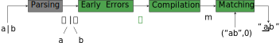

# Warblre: A Coq mechanization of ECMAScript regexes


The repository is structured as follows:

```
.
├── mechanization
│   ├── spec
│   │   └── base
│   ├── props
│   ├── tactics
│   └── utils
├── engines
│   ├── common
│   ├── ocaml
│   └── js
├── examples
│   ├── browser_playground
│   └── ocaml_example
├── fuzzer
├── tests
└── test262
```

## Mechanization

Contains the Coq code mechanizing the subset of the ECMAScript specification which describes regexes and their semantics.
It is based on the 14th edition from June 2023, available [here](https://262.ecma-international.org/14.0/).
Regexes are described in chapter [22.1](https://262.ecma-international.org/14.0/#sec-regexp-regular-expression-objects).

The way regexes work can be described using the following pipeline:



A regex is first parsed; 
it is then checked for *early errors*, and rejected if any are found; 
it is then compiled into a *matcher*;
it is finally called with a concrete input string and start position, and yield a match if one is found.

The mechanization covers the last three phases; parsing is not included.

Files are organized as follows:
- `spec`: the mechanization in itself, translating the paper specification into Coq.
- `props`: proofs about the specification. The main proofs are
    - **Compilation failure-free**: if a regex if early-errors-free, then its compilation into a matcher does not error.
    - **Matching failure-free**: if a matcher is provided with valid inputs, then the matching process does not error.
    - **Matching termination**: if a matcher is provided with valid inputs, then the matching process terminates.
    - **Strictly nullable optimisation**:
- `tactics`: some general purpose tactics.
- `utils`: auxiliary definitions, such as extra operations and proofs on lists, the error monad, typeclasses, ...

### Differences with the paper specification and other implementation choices

The mechanization leaves some operations abstract (e.g. character canonicalization).
It is then extracted as an OCaml functor, whose module parameter provides the missing types and operations.

One of the very few (if not the only) true difference between the paper specification and our mechanization is the handling of unicode mode.
In the specification, unicode mode is implemented by delegating some low-level operations (e.g. character canonicalization, string decoding) to different functions, one for each mode, e.g.
```
if flags.unicode then do_unicode () else do_utf ()
```
These operations overlap with the operations we would typically leave abstract, so the two modes are instead implemented as two different instantiations of the aforementioned OCaml functor
```
Parameters.do ()
```

## Engines

OCaml code used to instantiate concrete engines, as well as extra feature built on top of the extracted code (e.g. a pretty-printer for regexes, or functions to ease testing of regexes).

Being able to integrate the engine in a JavaScript runtime was a desirable feature.
In order to do it, we compiled some of the OCaml code to JavaScript using [melange](melange.re).
For reasons we will explain later ([here](#key-differences-between-the-ocaml-and-javascript-engines)), the JavaScript and OCaml engines have some slight differences.

The code is hence split in three directories:
- `common` contains the code which is common to both codebases;
- `ocaml` contains the instantiation of the two OCaml engines (one for regular mode, and one for unicode mode);
- `js` contains the instantiation of the two JavaScript engines, as well as some extra functionalities, such has functions to work with [array exotic objects](https://262.ecma-international.org/14.0/#sec-array-exotic-objects) (see [`ArrayExotic.ml`](engines/js/ArrayExotic.ml)) or parser for regexes, based upon [regexpp](https://github.com/eslint-community/regexpp).

A description of the executables implemented in this repository can be found in [`doc/Executables.md`](doc/Executables.md); each section will include a tag indicating whether that executable is built on the JavaScript or OCaml engine. 

### Key differences between the OCaml and JavaScript engines
