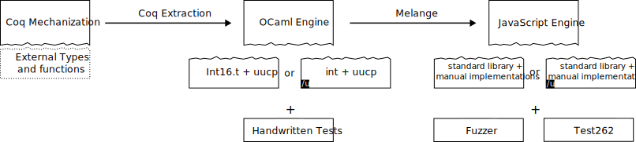

# Implementation choices, APIs and more

Some design choices had to be done during the mechanization.
We document here some of them, in hope this will make them easier to understand.

## From Coq to executable engines

### The clean picture

The Coq mechanization can be used to generate executable engines in both OCaml and JavaScript.
The OCaml code is obtained by using Coq's [extraction](https://coq.inria.fr/doc/v8.18/refman/addendum/extraction.html) feature.
OCaml code can then be compiled to JavaScript using the [Melange](https://github.com/melange-re/melange) compiler.

As will be discussed in the [API](#api) section, the Coq mechanization leaves some functions and datatypes abstract. 
These missing pieces are instantiated in each language, using libraries native to that specific language.
Note that the engine is instantiated **twice** in each language:
once to implement a "regular" engine (without unicode flags), and once to implement a "unicode" engine (with the `u` flag).
More precisely:
- **OCaml; non-`u`:**
    Characters are represented using `Int16.t` (from the [integers](https://github.com/yallop/ocaml-integers) library).
    The [uucp](https://github.com/dbuenzli/uucp) library is used to capitalize characters.
- **OCaml; `u`:**
    Characters are represented using `int`.
    Note that `UChar` are not used to allow for surrogate characters, as is allowed in JavaScript strings.
    The full case folding function provided by [uucp](https://github.com/dbuenzli/uucp) is used to implement simple case folding.
- **JavaScript; non-`u`:**
    Characters are represented using strings (which is standard in JavaScript).
    [`String.toUpperCase`](https://developer.mozilla.org/en-US/docs/Web/JavaScript/Reference/Global_Objects/String/toUpperCase) is used.
- **JavaScript; `u`:**
    Characters are represented using strings (which is standard in JavaScript).
    Case folding is implemented using an auto-generated associative map.



### The dirty detail: extraction is done twice

The previous presentation omits the fact that the OCaml code compiled to JavaScript is not exactly the same as the one used for native compilation.
More precisely, the two are generated from the same Coq code, using the same extraction directives, but the extracted code refers to some `BigInt` type,
which is implemented differently depending on the end target.

For "pure" OCaml, `BigInt` is implemented using [Zarith](https://github.com/ocaml/Zarith).
For JavaScript, it is implemented on top of JavaScript's [`BigInt`](https://developer.mozilla.org/en-US/docs/Web/JavaScript/Reference/Global_Objects/BigInt).

`BigInt` must be used to ensure that the semantics of Coq's `nat`/`N`/`Z` are preserved after extraction.
In particular, not extracting to `BigInt` ended up causing incorrect behaviors when using a quantifier whose bounds are close to the maximal integer (as in this [test](https://github.com/tc39/test262/blob/main/test/built-ins/RegExp/quantifier-integer-limit.js) from Test262), in which case the fuel computation might overflow.
Additionally, note that Melange's integers are limited to 32 bits (kind of: integers can be bigger, but will be truncated to 32 bits when performing arithmetic; see their [documentation](https://melange.re/v4.0.0/communicate-with-javascript.html#integers)), which means that `BigInt` are needed for arithmetic even if the number never go above `Number.MAX_SAFE_INTEGER`.

Since Melange/dune don't provide a way to provide JavaScript specific implementations of certain types/modules, this requires two instances of the extracted code.

## API

### Coq API: implicit parameter

See `spec/Parameters.v`.

As described [here](Differences.md#abstraction-layer), some details (character type and canonicalization, representation of sets, ...) of the specification are abstracted in the development.

This abstraction is achieved by parametrizing all functions with a typeclass which contains these abstracted types&operations.

This can be achieved by putting all functions manipulating objects from the specification or lemmas reasoning about it in a section defining the parameters of the specification as context parameters.
```Coq
Section AboutTheSpec.
    (* This contains all the parameters of the specification. *)
    Context `{specParameters: Parameters}.

    (* You can now refer to functions and types from the specification. *)
    Check Character: Type.
    Check Patterns.Regex: Type.
    Check Character.canonicalize: RegExpRecord -> Character -> Character.

    (* And define our own operations and lemmas. *)
    Definition canon_square (c: Character): Character :=
      let rer := RegExpRecord.make false false false tt 0 in
      Character.canonicalize rer (Character.canonicalize rer c).
End AboutTheSpec.
(* Now, [canon_square] has type [forall `{Parameters}, Character -> Character]. *)
About canon_square.
```

### OCaml API: modules & functors

See `spec/API.v`.

One drawback with the aforementioned abstraction mechanism is that types left abstract (such as `Character`), as well as types defined in term of these types (such as `Regex`), are dependent (as in "dependent types") on the `Parameters` argument.
This is fine while working from within Coq, but becomes a problem at extraction.

Since OCaml doesn't support dependent types, these types are replaced by `Obj.t`, which means that any kind of type-safety is lost.
This would force the clients of the OCaml API to rely heavily on `Obj.magic`,
which would make the API unsafe and error-prone.

This issue is solved in two parts:
1. The parameters & user facing APIs are repackaged using modules, which solves the issue for abstract types;
2. Other datatypes which are defined using these abstract types are made parametric on the types directly, rather than on `Parameters`.
   > For instance, instead of defining `Regex` as
   > ```Coq
   > Inductive Regex `{specParameters: Parameters} :=
   > | Char (chr: specParameters.(Character)) (* <- dependent on specParameters *)
   > | ...
   > ```
   > it is defined as
   > ```Coq
   > Inductive Regex {Character: Type} :=
   > | Char (chr: Character) (* <- parametric polymorphism *)
   > | ...
   > ```

This solution has one drawback: type inference has often no way of knowing that `Regex`'s `Character` parameter should instantiated to `specParameters.(Character)`.
To mitigate this, an implicit marker `CharacterMarker (T: Type)` for such types is added as an extra parameter to types such as `Regex`.
`Parameters` is also updated to provide an instance of this marker for the appropriate type, e.g. `character_marker:: CharacterMarker Character`;
since this marker will typically be the only instance of the marker type,
parameter inference will have to pick that instance, which in turn force the type parameter to be inferred as `specParameters.(Character)`.

> Continuing the previous example:
> a marker typeclass for `Character`s is defined
> ```Coq
> Class CharacterMarker (T: Type): Prop := mk_character_marker {}.
> ```
> and `Parameters` provides an instance
> ```
> Class Parameters := {
>   Character: Type;
>   character_marker:: CharacterMarker Character;
>   ...
> }.
> 
> And `Regex` gets an extra implicit marker argument
> ```Coq
> Inductive Regex {Character: Type} `{CharacterMarker} :=
> | Char (chr: Character)
> | ...
> ```

Note that markers live in `Prop`, which means they get erased during extraction: markers do not impact the extracted OCaml code.

## Looking ahead: what should/could changes

### Unicode handling: ICU4X

Currently, Unicode support is mostly hand-written, especially on the JavaScript side.
A better solution would be to rely on specialized libraries, e.g. [ICU4X](https://github.com/unicode-org/icu4x).

Advantages include:
- Reduces the amount of **unverified** code on our end;
- Maintained by the Unicode Consortium, which warrants a certain amount of confidence in the implementation's correctness;
- Provides specialized data structures tailored for unicode (e.g. unicode sets), which might improve the extracted engine's performance;
- Sketch a clear path toward engines supporting all unicode properties.

This was not done for two reasons:
- ICU4X does not offer OCaml support. [ICU4C](https://github.com/unicode-org/icu) could be used instead;
- JavaScript support is offered through a WebAssembly library, which should be inlined into our standalone JavaScript files.

### Modules in 

The Coq's API could be changed to rely on modules rather than typeclasses.
This doesn't seem to be the preferred way to do such things in Coq,
but this could dramatically reduce the amount of boilerplate needed to provide two different APIs.

### Abstracting (character) sequences

One suspected bottleneck of the engine is the representation of the input string.
It is currently represented as a (singly-linked) list of characters.

This means that accessing a character at a given index has a complexity of `O(length ls)`,
and computing the length of the list suffers from the same poor complexity.

This could be fixed by representing the input string differently, e.g. using arrays.
This could be achieved by either representing strings as an abstract type realized at extraction,
or by providing a typeclass (akin to `CharSet`).

### Off-by-one: lists sometimes start at 1

The specification uses lists to represent many different things (the input string, captured groups, ...).
These lists indices typically start at 0, but the list of captured groups is a notable exception: the indices start at 1.

This is currently implemented by leveraging the fact that 0-indexed lists are always indexed using `integer`s,
whereas the 1-indexed ones are indexed using `positive_integer`s.

Whether to start the indices at 0 or 1 is hence determined by the type used to index.
This should be changed to be an intrinsic property of lists, rather than inferred this way.
